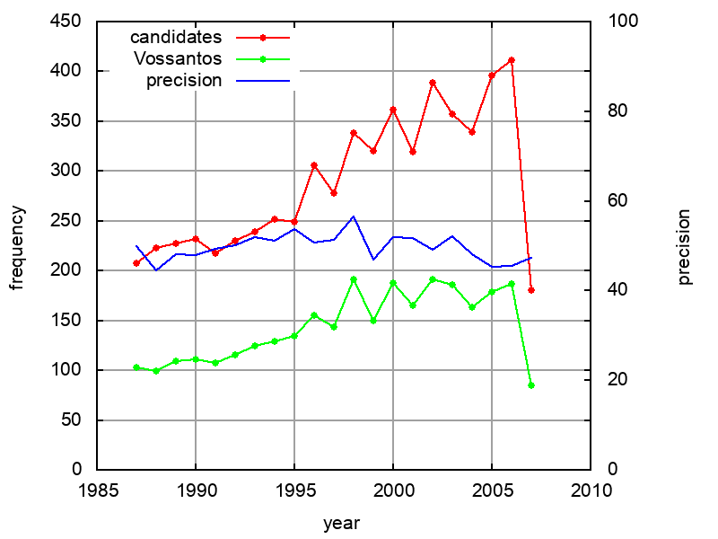
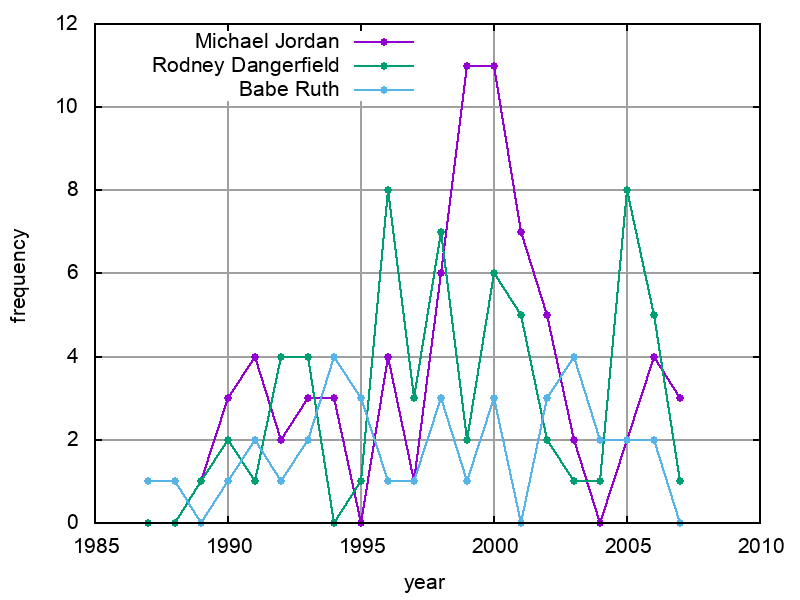

statistics
==========

temporal distribution
---------------------

We plot some temporal distributions:

``` bash
echo "year articles found true prec"
for year in $(seq 1987 2007); do
    echo $year \
     $(grep ^$year articles.tsv | cut -d' ' -f2) \
     $(../theof/org.py -y README.org | grep ${year} | wc -l) \
         $(../theof/org.py -y -c -b README.org | grep ${year} | awk -F$'\t' '{if ($2 == "D" || $3 == "True") print;}' | wc -l)
done
```

| year     | articles | found | true | prec   | ppm   |
|----------|----------|-------|------|--------|-------|
| 1987     | 106104   | 207   | 103  | 49.8   | 0.97  |
| 1988     | 104541   | 223   | 99   | 44.4   | 0.95  |
| 1989     | 102818   | 227   | 109  | 48.0   | 1.06  |
| 1990     | 98812    | 232   | 111  | 47.8   | 1.12  |
| 1991     | 85135    | 217   | 107  | 49.3   | 1.26  |
| 1992     | 82685    | 230   | 115  | 50.0   | 1.39  |
| 1993     | 79200    | 239   | 124  | 51.9   | 1.57  |
| 1994     | 74925    | 252   | 129  | 51.2   | 1.72  |
| 1995     | 85392    | 249   | 134  | 53.8   | 1.57  |
| 1996     | 79077    | 306   | 155  | 50.7   | 1.96  |
| 1997     | 85396    | 278   | 143  | 51.4   | 1.67  |
| 1998     | 89163    | 338   | 191  | 56.5   | 2.14  |
| 1999     | 91074    | 320   | 150  | 46.9   | 1.65  |
| 2000     | 94258    | 362   | 188  | 51.9   | 1.99  |
| 2001     | 96282    | 319   | 165  | 51.7   | 1.71  |
| 2002     | 97258    | 389   | 191  | 49.1   | 1.96  |
| 2003     | 94235    | 357   | 186  | 52.1   | 1.97  |
| 2004     | 91362    | 339   | 163  | 48.1   | 1.78  |
| 2005     | 90004    | 396   | 179  | 45.2   | 1.99  |
| 2006     | 87052    | 411   | 187  | 45.5   | 2.15  |
| 2007     | 39953    | 180   | 85   | 47.2   | 2.13  |
| **sum**  | 1854726  | 3753  | 3014 | 1042.5 | 34.71 |
| **mean** | 88320    | 289   | 144  | 49.8   | 1.63  |

: The temporal distribution of the number of found and true candidates.

``` gnuplot
reset
set datafile separator "\t"

set xlabel "year"
set ylabel "frequency"
set grid linetype 1 linecolor 0
set yrange [0:*]
set y2range [0:100]
set y2label 'precision'
set y2tics
set key top left
set style fill solid 1

set term svg enhanced size 800,600 dynamic fname "Palatino Linotype, Book Antiqua, Palatino, FreeSerif, serif" fsize 16
#set out "nyt_vossantos_over_time.svg"
plot data using 1:3 with linespoints pt 7 lc "red" title 'candidates',\
     data using 1:4 with linespoints pt 7 lc "green"  title 'Vossantos',\
     data using 1:5 with lines lc "blue" title 'precision' axes x1y2

# data using 1:2 with linespoints pt 7 axes x1y2 title 'cand',\
#     data using 1:3 with linespoints pt 7 axes x1y2 title 'wd',\

set term png enhanced size 800,600 font "Arial,16" lw  2
set out "nyt_vossantos_over_time.png"
replot

set key bottom left
set term pdf enhanced fontscale .7 lw 2
set out "nyt_vossantos_over_time.pdf"
replot


# ---- relative values

set key top left
set term svg enhanced size 800,600 dynamic fname "Palatino Linotype, Book Antiqua, Palatino, FreeSerif, serif" fsize 16
set out "nyt_vossantos_over_time_rel.svg"
set ylabel "frequency (per mille)"
set format y "%2.1f"

plot data using 1:($3/$2*1000) with linespoints pt 7 lc "red" title 'candidates',\
     data using 1:($4/$2*1000) with linespoints pt 7 lc "green"  title 'Vossantos',\
     data using 1:5 with lines lc "blue" title 'precision' axes x1y2


set term png enhanced size 800,600 font "Arial,16" lw  2
set out "nyt_vossantos_over_time_rel.png"
replot

set term pdf enhanced lw  2
set out "nyt_vossantos_over_time_rel.pdf"
replot
```

Absolute frequency: 

Relative frequency: 

sources
-------

### most frequent

The most frequent *sources* are:

``` bash
../theof/org.py -w -T README.org | sort | uniq -c | sort -nr | head -n40
```

| count | source                                                        |
|-------|---------------------------------------------------------------|
| 72    | [Michael Jordan](https://www.wikidata.org/wiki/Q41421)        |
| 62    | [Rodney Dangerfield](https://www.wikidata.org/wiki/Q436386)   |
| 40    | [Johnny Appleseed](https://www.wikidata.org/wiki/Q369675)     |
| 36    | [Elvis Presley](https://www.wikidata.org/wiki/Q303)           |
| 36    | [Babe Ruth](https://www.wikidata.org/wiki/Q213812)            |
| 25    | [Michelangelo](https://www.wikidata.org/wiki/Q5592)           |
| 25    | [Donald Trump](https://www.wikidata.org/wiki/Q22686)          |
| 23    | [Pablo Picasso](https://www.wikidata.org/wiki/Q5593)          |
| 23    | [Bill Gates](https://www.wikidata.org/wiki/Q5284)             |
| 23    | [Madonna](https://www.wikidata.org/wiki/Q1744)                |
| 21    | [Jackie Robinson](https://www.wikidata.org/wiki/Q221048)      |
| 20    | [P. T. Barnum](https://www.wikidata.org/wiki/Q223766)         |
| 20    | [Tiger Woods](https://www.wikidata.org/wiki/Q10993)           |
| 19    | [Martha Stewart](https://www.wikidata.org/wiki/Q234606)       |
| 17    | [William Shakespeare](https://www.wikidata.org/wiki/Q692)     |
| 17    | [Wolfgang Amadeus Mozart](https://www.wikidata.org/wiki/Q254) |
| 17    | [Cinderella](https://www.wikidata.org/wiki/Q13685096)         |
| 16    | [Henry Ford](https://www.wikidata.org/wiki/Q8768)             |
| 16    | [John Wayne](https://www.wikidata.org/wiki/Q40531)            |
| 15    | [Napoleon](https://www.wikidata.org/wiki/Q517)                |
| 14    | [Leonardo da Vinci](https://www.wikidata.org/wiki/Q762)       |
| 14    | [Greta Garbo](https://www.wikidata.org/wiki/Q5443)            |
| 14    | [Rosa Parks](https://www.wikidata.org/wiki/Q41921)            |
| 14    | [Adolf Hitler](https://www.wikidata.org/wiki/Q352)            |
| 14    | [Mother Teresa](https://www.wikidata.org/wiki/Q30547)         |
| 14    | [Ralph Nader](https://www.wikidata.org/wiki/Q193156)          |
| 13    | [Cal Ripken](https://www.wikidata.org/wiki/Q731168)           |
| 12    | [Willie Horton](https://www.wikidata.org/wiki/Q8021572)       |
| 12    | [Leo Tolstoy](https://www.wikidata.org/wiki/Q7243)            |
| 12    | [Rembrandt](https://www.wikidata.org/wiki/Q5598)              |
| 12    | [Oprah Winfrey](https://www.wikidata.org/wiki/Q55800)         |
| 12    | [Susan Lucci](https://www.wikidata.org/wiki/Q242936)          |
| 11    | [Walt Disney](https://www.wikidata.org/wiki/Q8704)            |
| 11    | [Mike Tyson](https://www.wikidata.org/wiki/Q79031)            |
| 10    | [Albert Einstein](https://www.wikidata.org/wiki/Q937)         |
| 10    | [Thomas Edison](https://www.wikidata.org/wiki/Q8743)          |
| 10    | [Paul Revere](https://www.wikidata.org/wiki/Q327071)          |
| 10    | [Julia Child](https://www.wikidata.org/wiki/Q214477)          |
| 10    | [Cassandra](https://www.wikidata.org/wiki/Q170779)            |
| 9     | [James Dean](https://www.wikidata.org/wiki/Q83359)            |

### temporal distribution

``` bash
for year in $(seq 1987 2007); do
  echo -n $year
  for s in "Michael_Jordan" "Rodney_Dangerfield" "Babe_Ruth"; do
    s=$(echo $s| sed "s/_/ /g")
    c=$(../theof/org.py -T -y -l README.org | grep ^$year | awk -F'\t' '{print $2}' | grep "^$s$" | wc -l)
    echo -n "\t$c"
  done
  echo
done
```

| year | Michael Jordan | Rodney Dangerfield | Babe Ruth |
|------|----------------|--------------------|-----------|
| 1987 | 0              | 0                  | 1         |
| 1988 | 0              | 0                  | 1         |
| 1989 | 1              | 1                  | 0         |
| 1990 | 3              | 2                  | 1         |
| 1991 | 4              | 1                  | 2         |
| 1992 | 2              | 4                  | 1         |
| 1993 | 3              | 4                  | 2         |
| 1994 | 3              | 0                  | 4         |
| 1995 | 0              | 1                  | 3         |
| 1996 | 4              | 8                  | 1         |
| 1997 | 1              | 3                  | 1         |
| 1998 | 6              | 7                  | 3         |
| 1999 | 11             | 2                  | 1         |
| 2000 | 11             | 6                  | 3         |
| 2001 | 7              | 5                  | 0         |
| 2002 | 5              | 2                  | 3         |
| 2003 | 2              | 1                  | 4         |
| 2004 | 0              | 1                  | 2         |
| 2005 | 2              | 8                  | 2         |
| 2006 | 4              | 5                  | 2         |
| 2007 | 3              | 1                  | 0         |
| sum  | 72             | 62                 | 37        |

``` gnuplot
reset
set datafile separator "\t"

set xlabel "year"
set ylabel "frequency"
set grid linetype 1 linecolor 0
set yrange [0:*]
set key top left
set style fill solid 1

set term svg enhanced size 800,600 dynamic fname "Palatino Linotype, Book Antiqua, Palatino, FreeSerif, serif" fsize 16
#set out "nyt_sources_over_time.svg"
plot data using 1:2 with linespoints pt 7 title 'Michael Jordan',\
     data using 1:3 with linespoints pt 7 title 'Rodney Dangerfield',\
     data using 1:4 with linespoints pt 7 title 'Babe Ruth'

set term png enhanced size 800,600 font "Arial,16" lw  2
set out "nyt_sources_over_time.png"
replot
```



categories
----------

### online

Extract the categories for the articles:

``` bash
export PYTHONIOENCODING=utf-8
for year in $(seq 1987 2007); do
    ../theof/nyt.py --category ../nyt_corpus_${year}.tar.gz \
        | sed -e "s/^nyt_corpus_//" -e "s/\.har\//\//" -e "s/\.xml\t/\t/" \
        | sort >> nyt_categories.tsv
done
```

Compute frequency distribution over all articles:

``` bash
cut -d$'\t' -f2 nyt_categories.tsv | sort -S1G | uniq -c \
   | sed -e "s/^ *//" -e "s/ /\t/" | awk -F'\t' '{print $2"\t"$1}' \
                                          > nyt_categories_distrib.tsv
```

Check the number of and the top categories:

``` bash
echo articles $(wc -l < nyt_categories.tsv)
echo categories $(wc -l < nyt_categories_distrib.tsv)
echo ""
sort -nrk2 nyt_categories_distrib.tsv | head
```

|            |         |
|------------|---------|
| articles   | 1854726 |
| categories | 1580    |
| Business   | 291982  |
| Sports     | 160888  |
| Opinion    | 134428  |
| U.S.       | 89389   |
| Arts       | 88460   |
| World      | 79786   |
| Style      | 65071   |
| Obituaries | 19430   |
| Magazine   | 11464   |
| Travel     | 10440   |

Collect the categories of the articles

``` bash
echo "vossantos" $(../theof/org.py -T README.org | wc -l) articles $(wc -l < nyt_categories.tsv)
../theof/org.py -T -f README.org | join nyt_categories.tsv - | sed "s/ /\t/" | awk -F'\t' '{print $2}' \
    | sort | uniq -c \
    | sed -e "s/^ *//" -e "s/ /\t/" | awk -F'\t' '{print $2"\t"$1}' \
    | join -t$'\t' -o1.2,1.1,2.2 - nyt_categories_distrib.tsv \
    | sort -nr | head -n20
```

| vossantos | 3014  | category               | articles | 1854726 |
|-----------|-------|------------------------|----------|---------|
| 364       | 12.1% | Arts                   | 88460    | 4.8%    |
| 362       | 12.0% | Sports                 | 160888   | 8.7%    |
| 327       | 10.8% | New York and Region    | 221897   | 12.0%   |
| 287       | 9.5%  | Arts; Books            | 35475    | 1.9%    |
| 186       | 6.2%  | Movies; Arts           | 27759    | 1.5%    |
| 125       | 4.1%  | Business               | 291982   | 15.7%   |
| 122       | 4.0%  | Opinion                | 134428   | 7.2%    |
| 110       | 3.6%  | U.S.                   | 89389    | 4.8%    |
| 104       | 3.5%  | Magazine               | 11464    | 0.6%    |
| 76        | 2.5%  | Arts; Theater          | 13283    | 0.7%    |
| 70        | 2.3%  | Style                  | 65071    | 3.5%    |
| 52        | 1.7%  | World                  | 79786    | 4.3%    |
| 49        | 1.6%  | Home and Garden; Style | 13978    | 0.8%    |
| 37        | 1.2%  |                        | 42157    | 2.3%    |
| 36        | 1.2%  | Travel                 | 10440    | 0.6%    |
| 35        | 1.2%  | Technology; Business   | 23283    | 1.3%    |
| 30        | 1.0%  | Week in Review         | 17107    | 0.9%    |
| 29        | 1.0%  | Home and Garden        | 5546     | 0.3%    |
| 18        | 0.6%  | Style; Magazine        | 1519     | 0.1%    |
| 18        | 0.6%  | Front Page; U.S.       | 11425    | 0.6%    |

### desks

Extract the desks for the articles:

``` bash
export PYTHONIOENCODING=utf-8
for year in $(seq 1987 2007); do
    ../theof/nyt.py --desk ../nyt_corpus_${year}.tar.gz \
        | sed -e "s/^nyt_corpus_//" -e "s/\.har\//\//" -e "s/\.xml\t/\t/" \
        | sort >> nyt_desks.tsv
done
```

Compute frequency distribution over all articles:

``` bash
cut -d$'\t' -f2 nyt_desks.tsv | sort -S1G | uniq -c \
   | sed -e "s/^ *//" -e "s/ /\t/" | awk -F'\t' '{print $2"\t"$1}' \
                                          > nyt_desks_distrib.tsv
```

Check the number of and the top categories:

``` bash
echo articles $(wc -l < nyt_desks.tsv)
echo categories $(wc -l < nyt_desks_distrib.tsv)
echo ""
sort -t$'\t' -nrk2 nyt_desks_distrib.tsv | head
```

|                         |         |
|-------------------------|---------|
| articles                | 1854727 |
| categories              | 398     |
| Metropolitan Desk       | 237896  |
| Financial Desk          | 206958  |
| Sports Desk             | 174823  |
| National Desk           | 143489  |
| Editorial Desk          | 131762  |
| Foreign Desk            | 129732  |
| Classified              | 129660  |
| Business/Financial Desk | 112951  |
| Society Desk            | 44032   |
| Cultural Desk           | 40342   |

Collect the desks of the articles

``` bash
echo "vossantos" $(../theof/org.py -T README.org | wc -l) articles $(wc -l < nyt_desks.tsv)
../theof/org.py -T -f README.org | join nyt_desks.tsv - | sed "s/ /\t/" | awk -F'\t' '{print $2}' \
    | sort | uniq -c \
    | sed -e "s/^ *//" -e "s/ /\t/" | awk -F'\t' '{print $2"\t"$1}' \
    | join -t$'\t' -o1.2,1.1,2.2 - nyt_desks_distrib.tsv \
    | sort -nr | head -n20
```

| vossantos | 3014  | desk                                 | articles | 1854726 |
|-----------|-------|--------------------------------------|----------|---------|
| 381       | 12.6% | Sports Desk                          | 174823   | 9.4%    |
| 222       | 7.4%  | Metropolitan Desk                    | 237896   | 12.8%   |
| 220       | 7.3%  | Book Review Desk                     | 32737    | 1.8%    |
| 180       | 6.0%  | National Desk                        | 143489   | 7.7%    |
| 171       | 5.7%  | The Arts/Cultural Desk               | 38136    | 2.1%    |
| 169       | 5.6%  | Arts and Leisure Desk                | 27765    | 1.5%    |
| 135       | 4.5%  | Magazine Desk                        | 25433    | 1.4%    |
| 125       | 4.1%  | Editorial Desk                       | 131762   | 7.1%    |
| 117       | 3.9%  | Cultural Desk                        | 40342    | 2.2%    |
| 99        | 3.3%  | Movies, Performing Arts/Weekend Desk | 13929    | 0.8%    |
| 96        | 3.2%  | Business/Financial Desk              | 112951   | 6.1%    |
| 90        | 3.0%  | Foreign Desk                         | 129732   | 7.0%    |
| 78        | 2.6%  | Weekend Desk                         | 18814    | 1.0%    |
| 74        | 2.5%  | Leisure/Weekend Desk                 | 10766    | 0.6%    |
| 72        | 2.4%  | Long Island Weekly Desk              | 20453    | 1.1%    |
| 69        | 2.3%  | Style Desk                           | 21569    | 1.2%    |
| 57        | 1.9%  | Financial Desk                       | 206958   | 11.2%   |
| 44        | 1.5%  | Arts & Leisure Desk                  | 6742     | 0.4%    |
| 42        | 1.4%  | The City Weekly Desk                 | 22863    | 1.2%    |
| 41        | 1.4%  | Connecticut Weekly Desk              | 17034    | 0.9%    |

Note: there are many errors in the specification of the desks ... so
this table should be digested with care.

authors
-------

Extract the authors for the articles:

``` bash
export PYTHONIOENCODING=utf-8
for year in $(seq 1987 2007); do
    ../theof/nyt.py --author ../nyt_corpus_${year}.tar.gz \
        | sed -e "s/^nyt_corpus_//" -e "s/\.har\//\//" -e "s/\.xml\t/\t/" \
        | sort >> nyt_authors.tsv
done
```

Compute frequency distribution over all articles:

``` bash
cut -d$'\t' -f2 nyt_authors.tsv | LC_ALL=C sort -S1G | uniq -c \
   | sed -e "s/^ *//" -e "s/ /\t/" | awk -F'\t' '{print $2"\t"$1}' \
                                          > nyt_authors_distrib.tsv
```

Check the number of and the top authors:

``` bash
echo articles $(wc -l < nyt_authors.tsv)
echo categories $(wc -l < nyt_authors_distrib.tsv)
echo ""
sort -t$'\t' -nrk2 nyt_authors_distrib.tsv | head 
```

|                     |         |
|---------------------|---------|
| articles            | 1854726 |
| categories          | 30691   |
|                     | 961052  |
| Elliott, Stuart     | 6296    |
| Holden, Stephen     | 5098    |
| Chass, Murray       | 4544    |
| Pareles, Jon        | 4090    |
| Brozan, Nadine      | 3741    |
| Fabricant, Florence | 3659    |
| Kozinn, Allan       | 3654    |
| Curry, Jack         | 3654    |
| Truscott, Alan      | 3646    |

**requires cleansing!**

Collect the authors of the articles

``` bash
echo "vossantos" $(../theof/org.py -T README.org | wc -l) articles $(wc -l < nyt_authors.tsv)
../theof/org.py -T -f README.org | join nyt_authors.tsv - | sed "s/ /\t/" | awk -F'\t' '{print $2}' \
    | LC_ALL=C sort | uniq -c \
    | sed -e "s/^ *//" -e "s/ /\t/" | awk -F'\t' '{print $2"\t"$1}' \
    | LC_ALL=C join -t$'\t' -o1.2,1.1,2.2 - nyt_authors_distrib.tsv \
    | sort -nr | head -n20
```

| vossantos | 3014  | author                | articles | 1854726 |
|-----------|-------|-----------------------|----------|---------|
| 470       | 15.6% |                       | 961052   | 51.8%   |
| 34        | 1.1%  | Maslin, Janet         | 2874     | 0.2%    |
| 32        | 1.1%  | Holden, Stephen       | 5098     | 0.3%    |
| 30        | 1.0%  | Vecsey, George        | 2739     | 0.1%    |
| 24        | 0.8%  | Sandomir, Richard     | 3140     | 0.2%    |
| 24        | 0.8%  | Dowd, Maureen         | 1647     | 0.1%    |
| 23        | 0.8%  | Ketcham, Diane        | 717      | 0.0%    |
| 20        | 0.7%  | Kisselgoff, Anna      | 2661     | 0.1%    |
| 20        | 0.7%  | Brown, Patricia Leigh | 568      | 0.0%    |
| 19        | 0.6%  | Kimmelman, Michael    | 1515     | 0.1%    |
| 19        | 0.6%  | Berkow, Ira           | 1704     | 0.1%    |
| 18        | 0.6%  | Barron, James         | 2188     | 0.1%    |
| 17        | 0.6%  | Stanley, Alessandra   | 1437     | 0.1%    |
| 17        | 0.6%  | Pareles, Jon          | 4090     | 0.2%    |
| 17        | 0.6%  | Lipsyte, Robert       | 817      | 0.0%    |
| 17        | 0.6%  | Araton, Harvey        | 1940     | 0.1%    |
| 16        | 0.5%  | Smith, Roberta        | 2497     | 0.1%    |
| 16        | 0.5%  | Martin, Douglas       | 1814     | 0.1%    |
| 16        | 0.5%  | Chass, Murray         | 4544     | 0.2%    |
| 15        | 0.5%  | Grimes, William       | 1368     | 0.1%    |

### Vossantos of the top author

``` bash
# extract list of articles
for article in $(../theof/org.py -T -f README.org | join nyt_authors.tsv - | grep "Maslin, Janet" | cut -d' ' -f1 ); do
  grep "$article" README.org
done
```

-   [Bob Hope](https://www.wikidata.org/wiki/Q94081)
    (1993/04/23/0604282) is loaded with rap-related cameos that work
    only if you recognize the players (Fab 5 Freddy, Kid Capri, Naughty
    by Nature and **the Bob Hope of** rap cinema, Ice-T), and have
    little intrinsic humor of their own.
-   [Sandy Dennis](https://www.wikidata.org/wiki/Q239691)
    (1993/09/03/0632371) (Ms. Lewis, who has many similar mannerisms,
    may be fast becoming **the Sandy Dennis of** her generation.)
-   [Dorian Gray](https://www.wikidata.org/wiki/Q465417)
    (1993/12/10/0654992) Also on hand is Aerosmith, **the Dorian Gray
    of** rock bands, to serve the same purpose Alice Cooper did in the
    first film.
-   [Adolf Hitler](https://www.wikidata.org/wiki/Q352)
    (1994/02/04/0666537) The terrors of the code, as overseen by Joseph
    Breen (who was nicknamed "**the Hitler of** Hollywood" in some
    quarters), went beyond the letter of the document and brought about
    a more generalized moral purge.
-   [Cinderella](https://www.wikidata.org/wiki/Q13685096)
    (1994/09/11/0711230) Kevin Smith, **the Cinderella of** this year\'s
    Sundance festival, shot this black-and-white movie in the New Jersey
    store where he himself worked.
-   [Hulk Hogan](https://www.wikidata.org/wiki/Q44176)
    (1994/10/25/0720551) Libby\'s cousin Andrew, an art director who\'s
    "so incredibly creative that, as my mother says, no one\'s holding
    their breath for grandchildren," opines that "David Mamet is **the
    Hulk Hogan of** the American theater and that his word processor
    should be tested for steroids."
-   [Andrew Dice Clay](https://www.wikidata.org/wiki/Q504455)
    (1995/09/22/0790066) Mr. Ezsterhas, **the Andrew Dice Clay of**
    screenwriting, bludgeons the audience with such tirelessly crude
    thoughts that when a group of chimps get loose in the showgirls\'
    dressing room and all they do is defecate, the film enjoys a rare
    moment of good taste.
-   [Thomas Jefferson](https://www.wikidata.org/wiki/Q11812)
    (1996/01/24/0825044) Last year\'s overnight sensation, Edward Burns
    of "The Brothers McMullen," came out of nowhere and now has Jennifer
    Aniston acting in his new film and Robert Redford, **the Thomas
    Jefferson of** Sundance, helping as a creative consultant.
-   [Elliott Gould](https://www.wikidata.org/wiki/Q314805)
    (1996/03/08/0835139) All coy grins and daffy mugging, Mr. Stiller
    plays the role as if aspiring to become **the Elliott Gould of** his
    generation.
-   [Charlie Parker](https://www.wikidata.org/wiki/Q103767)
    (1996/08/09/0870295) But for all its admiration, '\'Basquiat'\'
    winds up no closer to that assessment than to the critic Robert
    Hughes\'s more jaundiced one: '\'Far from being **the Charlie Parker
    of** SoHo (as his promoters claimed), he became its Jessica
    Savitch.'\'
-   [Aesop](https://www.wikidata.org/wiki/Q43423) (1996/08/09/0870300)
    Janet Maslin reviews movie Rendezvous in Paris, written and directed
    by Eric Rohmer; photo (M) Eric Rohmer\'s '\'Rendezvous in Paris'\'
    is an oasis of contemplative intelligence in the summer movie
    season, presenting three graceful and elegant parables with the
    moral agility that distinguishes Mr. Rohmer as **the Aesop of**
    amour.
-   [Diana Vreeland](https://www.wikidata.org/wiki/Q450619)
    (1997/06/06/0934955) The complex aural and visual style of '\'The
    Pillow Book'\' involves rectangular insets that flash back to Sei
    Shonagon (a kind of Windows 995) and illustrate the imperious little
    lists that made her sound like **the Diana Vreeland of**
    10th-century tastes.
-   [Peter Pan](https://www.wikidata.org/wiki/Q107190)
    (1997/08/08/0949060) Mr. Gibson, delivering one of the hearty,
    dynamic star turns that have made him **the Peter Pan of** the
    blockbuster set, makes Jerry much more boyishly likable than he
    deserves to be.
-   [Thomas Edison](https://www.wikidata.org/wiki/Q8743)
    (1997/09/19/0958685) Danny DeVito embodies this as a gleeful Sid
    Hudgens (a character whom Mr. Hanson has called \''**the Thomas
    Edison of** tabloid journalism''), who is the unscrupulous editor of
    a publication called Hush-Hush and winds up linked to many of the
    other characters' nastiest transgressions.
-   [John Wayne](https://www.wikidata.org/wiki/Q40531)
    (1997/09/26/0960422) Mr. Hopkins, whose creative collaboration with
    Bart goes back to '\'Legends of the Fall,'\' has called him \''**the
    John Wayne of** bears.'\'
-   [Annie Oakley](https://www.wikidata.org/wiki/Q230935)
    (1997/12/24/0982708) Running nearly as long as '\'Pulp Fiction'\'
    even though its ambitions are more familiar and small, '\'Jackie
    Brown'\' has the makings of another, chattier '\'Get Shorty'\' with
    an added homage to Pam Grier, **the Annie Oakley of** 1970\'s
    blaxploitation.
-   [Robin Hood](https://www.wikidata.org/wiki/Q122634)
    (1998/04/10/1008616) '\'Do not threaten to call the police or have
    him thrown out,'\' went a memorandum issued by another company, when
    **the Robin Hood of** corporate America went on the road to promote
    his book abou downsizing.
-   [Buster Keaton](https://www.wikidata.org/wiki/Q103949)
    (1998/09/18/1047276) Fortunately, being **the Buster Keaton of**
    martial arts, he makes a doleful expression and comedic physical
    grace take the place of small talk.
-   [Michelangelo](https://www.wikidata.org/wiki/Q5592)
    (1998/09/25/1049076) She goes to a plastic surgeon (Michael Lerner)
    who\'s been dubbed \''**the Michelangelo of** Manhattan'\' by
    Newsweek.
-   [Brian Wilson](https://www.wikidata.org/wiki/Q313013)
    (1998/12/31/1073562) The enrapturing beauty and peculiar naivete of
    '\'The Thin Red Line'\' heightened the impression of Terrence Malick
    as **the Brian Wilson of** the film world.
-   [Dante Alighieri](https://www.wikidata.org/wiki/Q1067)
    (1999/10/22/1147181) Though his latest film explores one more urban
    inferno and colorfully reaffirms Mr. Scorsese\'s role as **the Dante
    of** the Cinema, creating its air of nocturnal torment took some
    doing.
-   [Albert Einstein](https://www.wikidata.org/wiki/Q937)
    (2000/12/07/1253134) In this much coarser and more violent,
    action-heavy story, Mr. Deaver presents the villainous Dr. Aaron
    Matthews, whom a newspaper once called \''**the Einstein of**
    therapists'\' in the days before Hannibal Lecter became his main
    career influence.
-   [Émile Zola](https://www.wikidata.org/wiki/Q504)
    (2001/03/09/1276449) 'Right as Rain' George P. Pelecanos arrives
    with the best possible recommendations from other crime writers
    (e.g., Elmore Leonard likes him), and with jacket copy praising him
    as \''**the Zola of** Washington, D.C.'\' But what he really
    displays here, in great abundance and to entertaining effect, is a
    Tarantino touch.
-   [Leonard Cohen](https://www.wikidata.org/wiki/Q1276)
    (2002/08/22/1417676) The wry, sexy melancholy of his observations
    would be seductive enough in its own right -- he is **the Leonard
    Cohen of** the spy genre -- even without the sharp political acuity
    that accompanies it.
-   [Kato Kaelin](https://www.wikidata.org/wiki/Q6377737)
    (2003/04/07/1478881) Then he has settled in -- as '\'a permanent
    house guest, **the Kato Kaelin of** the wine country,'\' in the case
    of Alan Deutschman -- and tried to figure out what it all means.
-   [Hulk Hogan](https://www.wikidata.org/wiki/Q44176)
    (2003/04/14/1480850) Meanwhile, at 5 feet 10 tall and 115 pounds,
    Andy is **the Hulk Hogan of** this food-phobic crowd.
-   [Nora Roberts](https://www.wikidata.org/wiki/Q231356)
    (2003/04/17/1481531) For those who write like clockwork (i.e.,
    Stuart Woods, **the Nora Roberts of** mystery best-sellerdom), a new
    book every few months is no surprise.
-   [Henny Youngman](https://www.wikidata.org/wiki/Q2586583)
    (2004/03/05/1563840) Together Mr. Yetnikoff and Mr. Ritz devise a
    kind of sitcom snappiness that turns Mr. Yetnikoff into **the Henny
    Youngman of** CBS.
-   [Frank Stallone](https://www.wikidata.org/wiki/Q959153)
    (2004/09/20/1612886) He can read the biblical story of Aaron and
    imagine \''**the Frank Stallone of** ancient Judaism.'\'
-   [Marlon Brando](https://www.wikidata.org/wiki/Q34012)
    (2005/11/08/1715899) He named his daughter Tuesday, after the
    actress Tuesday Weld, whom Sam Shepard once called \''**the Marlon
    Brando of** women.'\'
-   [Jesse James](https://www.wikidata.org/wiki/Q213626)
    (2005/12/09/1723424) How else to explain '\'Comma Sense,'\' which
    has a blurb from Ms. Truss and claims that the apostrophe is **the
    Jesse James of** punctuation marks?
-   [Elton John](https://www.wikidata.org/wiki/Q2808)
    (2006/12/11/1811150) Though Foujita had a fashion sense that made
    him look like **the Elton John of** Montparnasse (he favored
    earrings, bangs and show-stopping homemade costumes), and though he
    is seen here hand in hand with a male Japanese friend during their
    shared tunic-wearing phase, he is viewed by Ms. Birnbaum strictly as
    a lady-killer.
-   [Ernest Hemingway](https://www.wikidata.org/wiki/Q23434)
    (2007/04/30/1844006) Mr. Browne also points out that when he
    introduced Mr. Zevon to an audience as \''**the Ernest Hemingway
    of** the twelve-string guitar,'\' Mr. Zevon said he was more like
    Charles Bronson.

modifiers
---------

``` bash
../theof/org.py -o -a -T README.org \
    | awk -F$'\t' '$2 != "" {print $2;}' \
    | sort | uniq -c | sort -nr | head -n30
```

| count | modifier         |
|-------|------------------|
| 56    | his day          |
| 34    | his time         |
| 29    | Japan            |
| 17    | China            |
| 16    | tennis           |
| 16    | his generation   |
| 16    | baseball         |
| 14    | her time         |
| 13    | our time         |
| 13    | her day          |
| 12    | the Zulus        |
| 11    | the 90\'s        |
| 11    | the 1990\'s      |
| 11    | politics         |
| 11    | hockey           |
| 10    | the art world    |
| 10    | Brazil           |
| 10    | basketball       |
| 10    | ballet           |
| 9     | jazz             |
| 9     | fashion          |
| 8     | today            |
| 8     | Iran             |
| 8     | his era          |
| 8     | hip-hop          |
| 8     | golf             |
| 8     | football         |
| 8     | dance            |
| 7     | the 19th century |
| 7     | Mexico           |

### today

#### "today"

Who are the sources for the modifier "today"?

``` bash
../theof/org.py -w -o -T README.org \
    | awk -F$'\t' '$1 == "today" {print $2;}' \
    | sort | uniq -c | sort -nr
```

| count | source                                                          |
|-------|-----------------------------------------------------------------|
| 1     | [Shoeless Joe Jackson](https://www.wikidata.org/wiki/Q955322)   |
| 1     | [Buck Rogers](https://www.wikidata.org/wiki/Q4982930)           |
| 1     | [Bill McGowan](https://www.wikidata.org/wiki/Q4910116)          |
| 1     | [William F. Buckley Jr.](https://www.wikidata.org/wiki/Q378098) |
| 1     | [Ralph Fiennes](https://www.wikidata.org/wiki/Q28493)           |
| 1     | [Julie London](https://www.wikidata.org/wiki/Q231255)           |
| 1     | [Jimmy Osmond](https://www.wikidata.org/wiki/Q1689414)          |
| 1     | [Harry Cohn](https://www.wikidata.org/wiki/Q1586470)            |

#### "his day", "his time", or "his generation"

Who are the sources for the modifiers "his day", "his time", and "his
generation"?

``` bash
../theof/org.py -w -o -T README.org \
    | awk -F$'\t' '$1 ~ "his (day|time|generation)" {print $2;}' \
    | sort | uniq -c | sort -nr | head
```

| count | source                                                       |
|-------|--------------------------------------------------------------|
| 3     | [Donald Trump](https://www.wikidata.org/wiki/Q22686)         |
| 2     | [Mike Tyson](https://www.wikidata.org/wiki/Q79031)           |
| 2     | [Pablo Picasso](https://www.wikidata.org/wiki/Q5593)         |
| 2     | [Billy Martin](https://www.wikidata.org/wiki/Q508574)        |
| 2     | [Dan Quayle](https://www.wikidata.org/wiki/Q49214)           |
| 2     | [Arnold Schwarzenegger](https://www.wikidata.org/wiki/Q2685) |
| 2     | [Martha Stewart](https://www.wikidata.org/wiki/Q234606)      |
| 2     | [L. Ron Hubbard](https://www.wikidata.org/wiki/Q216896)      |
| 2     | [Tiger Woods](https://www.wikidata.org/wiki/Q10993)          |

#### "her day", "her time", or "her generation"

Who are the sources for the modifiers "her day", "her time", and "her
generation"?

``` bash
../theof/org.py -w -o -T README.org \
    | awk -F$'\t' '$1 ~ "her (day|time|generation)" {print $2;}' \
    | sort | uniq -c | sort -nr | head
```

| count | source                                                   |
|-------|----------------------------------------------------------|
| 4     | [Madonna](https://www.wikidata.org/wiki/Q1744)           |
| 2     | [Laurie Anderson](https://www.wikidata.org/wiki/Q235066) |
| 1     | [Hilary Swank](https://www.wikidata.org/wiki/Q93187)     |
| 1     | [Pamela Anderson](https://www.wikidata.org/wiki/Q83325)  |
| 1     | [Hillary Clinton](https://www.wikidata.org/wiki/Q6294)   |
| 1     | [Lotte Lehmann](https://www.wikidata.org/wiki/Q60303)    |
| 1     | [Oprah Winfrey](https://www.wikidata.org/wiki/Q55800)    |
| 1     | [Marilyn Monroe](https://www.wikidata.org/wiki/Q4616)    |
| 1     | [Coco Chanel](https://www.wikidata.org/wiki/Q45661)      |
| 1     | [Judith Krantz](https://www.wikidata.org/wiki/Q452206)   |

### country

``` bash
../theof/org.py -w -o -T README.org \
    | awk -F$'\t' '$1 ~ "(Japan|China|Brazil|Iran|Israel|Mexico|India|South Africa|Spain|South Korea|Russia|Poland|Pakistan)" {print $1;}' \
    | sort | uniq -c | sort -nr | head
```

| count | country      |
|-------|--------------|
| 29    | Japan        |
| 17    | China        |
| 10    | Brazil       |
| 8     | Iran         |
| 7     | Mexico       |
| 7     | Israel       |
| 7     | India        |
| 4     | South Africa |
| 4     | Poland       |
| 3     | Spain        |

What are the sources for the modifier ... ?

#### "Japan"

``` bash
../theof/org.py -w -o -T README.org \
    | awk -F$'\t' '$1 == "Japan" {print $2;}' \
    | sort | uniq -c | sort -nr
```

| count | source                                                  |
|-------|---------------------------------------------------------|
| 5     | [Walt Disney](https://www.wikidata.org/wiki/Q8704)      |
| 4     | [Bill Gates](https://www.wikidata.org/wiki/Q5284)       |
| 2     | [Nolan Ryan](https://www.wikidata.org/wiki/Q721948)     |
| 2     | [Frank Sinatra](https://www.wikidata.org/wiki/Q40912)   |
| 1     | [Richard Perle](https://www.wikidata.org/wiki/Q966859)  |
| 1     | [Thomas Edison](https://www.wikidata.org/wiki/Q8743)    |
| 1     | [Cal Ripken](https://www.wikidata.org/wiki/Q731168)     |
| 1     | [Walter Johnson](https://www.wikidata.org/wiki/Q722059) |
| 1     | [Andy Warhol](https://www.wikidata.org/wiki/Q5603)      |
| 1     | [Pablo Picasso](https://www.wikidata.org/wiki/Q5593)    |
| 1     | [William Wyler](https://www.wikidata.org/wiki/Q51495)   |
| 1     | [Stephen King](https://www.wikidata.org/wiki/Q39829)    |
| 1     | [Brad Pitt](https://www.wikidata.org/wiki/Q35332)       |
| 1     | [Richard Avedon](https://www.wikidata.org/wiki/Q305497) |
| 1     | [P. D. James](https://www.wikidata.org/wiki/Q270648)    |
| 1     | [Rem Koolhaas](https://www.wikidata.org/wiki/Q232364)   |
| 1     | [Steve Jobs](https://www.wikidata.org/wiki/Q19837)      |
| 1     | [Ralph Nader](https://www.wikidata.org/wiki/Q193156)    |
| 1     | [Madonna](https://www.wikidata.org/wiki/Q1744)          |
| 1     | [Jack Kerouac](https://www.wikidata.org/wiki/Q160534)   |

#### "China"

``` bash
../theof/org.py -w -o -T README.org \
    | awk -F$'\t' '$1 == "China" {print $2;}' \
    | sort | uniq -c | sort -nr
```

| count | source                                                          |
|-------|-----------------------------------------------------------------|
| 4     | [Barbara Walters](https://www.wikidata.org/wiki/Q231417)        |
| 2     | [Jack Welch](https://www.wikidata.org/wiki/Q355314)             |
| 2     | [Larry King](https://www.wikidata.org/wiki/Q213430)             |
| 1     | [Louis XIV of France](https://www.wikidata.org/wiki/Q7742)      |
| 1     | [Oskar Schindler](https://www.wikidata.org/wiki/Q60029)         |
| 1     | [Napoleon](https://www.wikidata.org/wiki/Q517)                  |
| 1     | [Keith Haring](https://www.wikidata.org/wiki/Q485635)           |
| 1     | [Mikhail Gorbachev](https://www.wikidata.org/wiki/Q30487)       |
| 1     | [Donald Trump](https://www.wikidata.org/wiki/Q22686)            |
| 1     | [Ted Turner](https://www.wikidata.org/wiki/Q193368)             |
| 1     | [Madonna](https://www.wikidata.org/wiki/Q1744)                  |
| 1     | [The Scarlet Pimpernel](https://www.wikidata.org/wiki/Q1126679) |

#### "Brazil"

``` bash
../theof/org.py -w -o -T README.org \
    | awk -F$'\t' '$1 == "Brazil" {print $2;}' \
    | sort | uniq -c | sort -nr
```

| count | source                                                 |
|-------|--------------------------------------------------------|
| 1     | [Giuseppe Verdi](https://www.wikidata.org/wiki/Q7317)  |
| 1     | [Jil Sander](https://www.wikidata.org/wiki/Q69066)     |
| 1     | [Walter Reed](https://www.wikidata.org/wiki/Q613136)   |
| 1     | [Lech Wałęsa](https://www.wikidata.org/wiki/Q444)      |
| 1     | [Jim Morrison](https://www.wikidata.org/wiki/Q44301)   |
| 1     | [Bob Dylan](https://www.wikidata.org/wiki/Q392)        |
| 1     | [Elvis Presley](https://www.wikidata.org/wiki/Q303)    |
| 1     | [Scott Joplin](https://www.wikidata.org/wiki/Q191499)  |
| 1     | [Larry Bird](https://www.wikidata.org/wiki/Q190152)    |
| 1     | [Pablo Escobar](https://www.wikidata.org/wiki/Q187447) |

### sports

``` bash
../theof/org.py -w -o -T README.org \
    | awk -F$'\t' '$1 ~ "(baseball|basketball|tennis|golf|football|racing|soccer|sailing)" {print $1;}' \
    | sort | uniq -c | sort -nr 
```

| count | sports                                                 |
|-------|--------------------------------------------------------|
| 16    | tennis                                                 |
| 16    | baseball                                               |
| 10    | basketball                                             |
| 8     | golf                                                   |
| 8     | football                                               |
| 6     | soccer                                                 |
| 6     | racing                                                 |
| 3     | women\'s basketball                                    |
| 3     | sailing                                                |
| 3     | auto racing                                            |
| 2     | pro football                                           |
| 2     | New York baseball                                      |
| 1     | Yale football fame                                     |
| 1     | women\'s college soccer                                |
| 1     | this year\'s national collegiate basketball tournament |
| 1     | the tennis tour                                        |
| 1     | the tennis field                                       |
| 1     | the soccer set                                         |
| 1     | the racing world                                       |
| 1     | stock-car racing                                       |
| 1     | Rotisserie baseball                                    |
| 1     | pro football owners                                    |
| 1     | professional basketball coaches                        |
| 1     | professional basketball                                |
| 1     | motocross racing in the 1980\'s                        |
| 1     | micro golfers                                          |
| 1     | major league baseball                                  |
| 1     | Laser sailing                                          |
| 1     | Japanese baseball                                      |
| 1     | Iraqi soccer                                           |
| 1     | horse racing                                           |
| 1     | high school baseball in New York                       |
| 1     | harness racing                                         |
| 1     | golf criticism                                         |
| 1     | football teams                                         |
| 1     | football owners                                        |
| 1     | football announcers                                    |
| 1     | country-club golf                                      |
| 1     | college football these days                            |
| 1     | college football                                       |
| 1     | college basketball                                     |
| 1     | Chinese baseball                                       |
| 1     | Brazilian basketball for the past 20 years             |
| 1     | BMX racing                                             |
| 1     | biddy basketball                                       |
| 1     | basketball announcers                                  |
| 1     | basketball analysts                                    |
| 1     | basketball analysis                                    |
| 1     | baseball\'s new era                                    |
| 1     | baseball managers                                      |
| 1     | baseball executives                                    |
| 1     | baseball collections                                   |
| 1     | baseball cards                                         |

Who are the sources for the modifier ... ?

#### baseball

``` bash
../theof/org.py -w -o -T README.org \
    | awk -F$'\t' '$1 == "baseball" {print $2;}' \
    | sort | uniq -c | sort -nr
```

| count | source                                                      |
|-------|-------------------------------------------------------------|
| 2     | [P. T. Barnum](https://www.wikidata.org/wiki/Q223766)       |
| 2     | [Larry Bird](https://www.wikidata.org/wiki/Q190152)         |
| 1     | [Clifford Irving](https://www.wikidata.org/wiki/Q960612)    |
| 1     | [Mike Tyson](https://www.wikidata.org/wiki/Q79031)          |
| 1     | [Thomas Dooley](https://www.wikidata.org/wiki/Q695751)      |
| 1     | [Marco Polo](https://www.wikidata.org/wiki/Q6101)           |
| 1     | [Pablo Picasso](https://www.wikidata.org/wiki/Q5593)        |
| 1     | [Horatio Alger](https://www.wikidata.org/wiki/Q453251)      |
| 1     | [Rodney Dangerfield](https://www.wikidata.org/wiki/Q436386) |
| 1     | [Michael Jordan](https://www.wikidata.org/wiki/Q41421)      |
| 1     | [Alan Alda](https://www.wikidata.org/wiki/Q310394)          |
| 1     | [Brandon Tartikoff](https://www.wikidata.org/wiki/Q2923786) |
| 1     | [Howard Hughes](https://www.wikidata.org/wiki/Q189081)      |
| 1     | [Thomas Jefferson](https://www.wikidata.org/wiki/Q11812)    |

#### tennis

``` bash
../theof/org.py -w -o -T README.org \
    | awk -F$'\t' '$1 == "tennis" {print $2;}' \
    | sort | uniq -c | sort -nr
```

| count | source                                                   |
|-------|----------------------------------------------------------|
| 2     | [George Foreman](https://www.wikidata.org/wiki/Q213919)  |
| 1     | [Tim McCarver](https://www.wikidata.org/wiki/Q7803927)   |
| 1     | [Pete Rose](https://www.wikidata.org/wiki/Q739866)       |
| 1     | [Nolan Ryan](https://www.wikidata.org/wiki/Q721948)      |
| 1     | [Crash Davis](https://www.wikidata.org/wiki/Q5182352)    |
| 1     | [Spike Lee](https://www.wikidata.org/wiki/Q51566)        |
| 1     | [John Madden](https://www.wikidata.org/wiki/Q51516)      |
| 1     | [Michael Jordan](https://www.wikidata.org/wiki/Q41421)   |
| 1     | [John Wayne](https://www.wikidata.org/wiki/Q40531)       |
| 1     | [George Hamilton](https://www.wikidata.org/wiki/Q359416) |
| 1     | [Michael Dukakis](https://www.wikidata.org/wiki/Q319099) |
| 1     | [Jackie Robinson](https://www.wikidata.org/wiki/Q221048) |
| 1     | [Babe Ruth](https://www.wikidata.org/wiki/Q213812)       |
| 1     | [Dennis Rodman](https://www.wikidata.org/wiki/Q201608)   |
| 1     | [Madonna](https://www.wikidata.org/wiki/Q1744)           |

#### basketball

``` bash
../theof/org.py -w -o -T README.org \
    | awk -F$'\t' '$1 == "basketball" {print $2;}' \
    | sort | uniq -c | sort -nr
```

| count | source                                                         |
|-------|----------------------------------------------------------------|
| 2     | [Babe Ruth](https://www.wikidata.org/wiki/Q213812)             |
| 1     | [Joseph Stalin](https://www.wikidata.org/wiki/Q855)            |
| 1     | [Martin Luther King, Jr.](https://www.wikidata.org/wiki/Q8027) |
| 1     | [Pol Pot](https://www.wikidata.org/wiki/Q39464)                |
| 1     | [Johnny Appleseed](https://www.wikidata.org/wiki/Q369675)      |
| 1     | [Adolf Hitler](https://www.wikidata.org/wiki/Q352)             |
| 1     | [Bugsy Siegel](https://www.wikidata.org/wiki/Q315487)          |
| 1     | [Elvis Presley](https://www.wikidata.org/wiki/Q303)            |
| 1     | [Chuck Yeager](https://www.wikidata.org/wiki/Q271939)          |

#### football

``` bash
../theof/org.py -w -o -T README.org \
    | awk -F$'\t' '$1 == "football" {print $2;}' \
    | sort | uniq -c | sort -nr
```

| count | source                                                   |
|-------|----------------------------------------------------------|
| 1     | [Ann Calvello](https://www.wikidata.org/wiki/Q4766303)   |
| 1     | [Michael Jordan](https://www.wikidata.org/wiki/Q41421)   |
| 1     | [Bobby Fischer](https://www.wikidata.org/wiki/Q41314)    |
| 1     | [Patrick Henry](https://www.wikidata.org/wiki/Q311885)   |
| 1     | [Susan Lucci](https://www.wikidata.org/wiki/Q242936)     |
| 1     | [Jackie Robinson](https://www.wikidata.org/wiki/Q221048) |
| 1     | [Babe Ruth](https://www.wikidata.org/wiki/Q213812)       |
| 1     | [Rich Little](https://www.wikidata.org/wiki/Q1341644)    |

#### racing

``` bash
../theof/org.py -w -o -T README.org \
    | awk -F$'\t' '$1 == "racing" {print $2;}' \
    | sort | uniq -c | sort -nr
```

| count | source                                                      |
|-------|-------------------------------------------------------------|
| 2     | [Rodney Dangerfield](https://www.wikidata.org/wiki/Q436386) |
| 1     | [John Madden](https://www.wikidata.org/wiki/Q51516)         |
| 1     | [Bobo Holloman](https://www.wikidata.org/wiki/Q4935855)     |
| 1     | [Lou Gehrig](https://www.wikidata.org/wiki/Q357444)         |
| 1     | [Wayne Gretzky](https://www.wikidata.org/wiki/Q209518)      |

#### golf

``` bash
../theof/org.py -w -o -T README.org \
    | awk -F$'\t' '$1 == "golf" {print $2;}' \
    | sort | uniq -c | sort -nr
```

| count | source                                                   |
|-------|----------------------------------------------------------|
| 2     | [Michael Jordan](https://www.wikidata.org/wiki/Q41421)   |
| 2     | [Jackie Robinson](https://www.wikidata.org/wiki/Q221048) |
| 1     | [J. D. Salinger](https://www.wikidata.org/wiki/Q79904)   |
| 1     | [James Brown](https://www.wikidata.org/wiki/Q5950)       |
| 1     | [Marlon Brando](https://www.wikidata.org/wiki/Q34012)    |
| 1     | [Babe Ruth](https://www.wikidata.org/wiki/Q213812)       |

### culture

``` bash
../theof/org.py -w -o -T README.org \
    | awk -F$'\t' '$1 ~ "(dance|hip-hop|jazz|fashion|weaving|ballet|the art world|wine|salsa|juggling|tango)" {print $1;}' \
    | sort | uniq -c | sort -nr | head -n13
```

| count | modifier             |
|-------|----------------------|
| 10    | the art world        |
| 10    | ballet               |
| 9     | jazz                 |
| 9     | fashion              |
| 8     | hip-hop              |
| 8     | dance                |
| 4     | wine                 |
| 4     | salsa                |
| 2     | the hip-hop world    |
| 2     | the fashion world    |
| 2     | the fashion industry |
| 2     | the dance world      |
| 2     | juggling             |

### Michael Jordan

``` bash
../theof/org.py -T -l -o README.org \
    | awk -F$'\t' '{if ($1 == "Michael Jordan") print $2}' \
    | sort -u
```

the Michael Jordan of

-   ...
-   12th men
-   actresses
-   Afghanistan
-   Australia
-   baseball
-   BMX racing
-   boxing
-   Brazilian basketball for the past 20 years
-   bull riding
-   college coaches
-   computer games
-   cricket
-   cyberspace
-   dance
-   diving
-   dressage horses
-   fast food
-   figure skating
-   foosball
-   football
-   game shows
-   geopolitics
-   golf
-   Harlem
-   her time
-   his day
-   his sport
-   his team
-   his time
-   hockey
-   horse racing
-   hunting and fishing
-   Indiana
-   integrating insurance and health care
-   julienne
-   jumpers
-   language
-   Laser sailing
-   late-night TV
-   management in Digital
-   Mexico
-   motocross racing in the 1980\'s
-   orange juice
-   real-life bulls
-   recording
-   Sauternes
-   snowboarding
-   soccer
-   television puppets
-   tennis
-   the Buffalo team
-   the dirt set
-   the Eagles
-   the game
-   the Hudson
-   the National Football League
-   the South Korean penal system
-   the sport
-   the White Sox
-   this sport
-   women\'s ball
-   women\'s basketball
